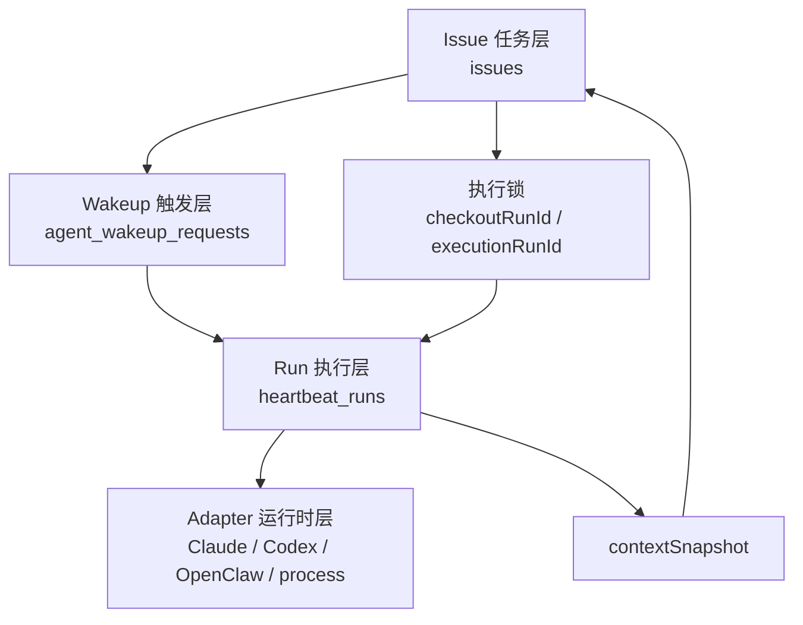

# Paperclip Agent 编排与 Issue 执行模型

## 1. 文档目的

本文用于说明 Paperclip 当前版本的 Agent 编排机制，回答以下问题：

- 编排是否建立在 `Issue` 之上
- `Issue`、`agent_wakeup_requests`、`heartbeat_runs` 三者分别承担什么职责
- 一次任务从被分配到真正执行，系统内部如何流转
- 如果要在 OpenClaw UI 或相似产品中接入这套模型，前端和交互层应该如何理解它

本文面向产品、前端、后端和集成开发者，目标不是介绍所有实现细节，而是给出可以直接落地的系统理解框架。

---

## 2. 一句话结论

Paperclip 不是“完全建立在 Issue 上”的系统，也不是“完全建立在 Agent runtime 上”的系统。

更准确的说法是：

- `Issue` 是核心任务实体
- `Agent heartbeat` 是核心调度与执行实体
- `agent_wakeup_requests` 是触发与排队层
- `heartbeat_runs` 是实际执行层

因此，Paperclip 的结构应理解为：

**Issue-based tasking + heartbeat-based orchestration**

也就是：

- 任务语义围绕 `Issue`
- 调度语义围绕 `Agent`
- 两者通过执行锁、上下文快照和 run 绑定关系连接起来

---

## 3. 核心对象职责

## 3.1 `issues`

`issues` 是系统中的核心任务实体，用来表达：

- 任务标题、描述、优先级、状态
- 任务与公司、项目、目标、父任务的关系
- 当前 assignee 是谁
- 当前是否已经被某个 run checkout
- 当前是否已经被某个 run 占用执行

它解决的是“做什么”和“谁在做”的问题。

`issues` 不是执行器本身，但它决定了任务边界、单人领取语义和执行所有权。

关键字段：

- `assigneeAgentId`
- `status`
- `checkoutRunId`
- `executionRunId`
- `executionAgentNameKey`

其中：

- `checkoutRunId` 表示哪个 run 成功领取了该任务
- `executionRunId` 表示当前哪个 run 正在占用该任务的执行权

---

## 3.2 `agent_wakeup_requests`

`agent_wakeup_requests` 是触发与排队层。

它解决的是“为什么要唤醒某个 agent”以及“这次唤醒目前处于什么状态”的问题。

常见来源包括：

- 定时心跳
- Issue 被分配
- Issue 被 checkout
- Issue 被评论
- Issue 在评论中被 @ 提及
- 人工手动唤醒
- 自动化逻辑触发

关键字段：

- `agentId`
- `source`
- `triggerDetail`
- `reason`
- `payload`
- `status`
- `runId`

它本质上不是任务表，而是“唤醒事件表”。

---

## 3.3 `heartbeat_runs`

`heartbeat_runs` 是真正的执行实体。

每一条 `heartbeat_run` 代表一次 agent heartbeat 的实际运行实例，负责记录：

- 谁在跑
- 什么时候开始/结束
- 当前状态
- 输入上下文
- 日志
- session 前后状态
- 结果、错误、token usage、成本

它解决的是“这次执行发生了什么”的问题。

关键字段：

- `agentId`
- `status`
- `invocationSource`
- `wakeupRequestId`
- `contextSnapshot`
- `sessionIdBefore`
- `sessionIdAfter`

如果说 `Issue` 是任务卡片，那么 `heartbeat_run` 就是实际执行该卡片的一次工作进程记录。

---

## 3.4 `agents`

`agents` 是执行主体。

它描述：

- agent 属于哪个公司
- 当前状态
- 用哪种 adapter 运行
- runtime 配置是什么
- 心跳策略是什么

Paperclip 不强绑定某一种 agent runtime，而是通过 adapter 调用不同执行后端，例如：

- Claude local
- Codex local
- Cursor local
- Gemini local
- OpenCode local
- OpenClaw Gateway
- process/http adapter

因此，Paperclip 的编排层是通用的，runtime 是可插拔的。

---

## 4. 总体架构理解

可以把 Paperclip 的编排拆成四层：

1. 任务层：`issues`
2. 触发层：`agent_wakeup_requests`
3. 执行层：`heartbeat_runs`
4. 运行时层：adapter + 外部 agent runtime

对应关系如下：



这个结构说明：

- `Issue` 负责定义任务与锁
- `Wakeup` 负责定义触发原因与排队状态
- `Run` 负责定义一次真正执行
- `Adapter` 负责把执行请求送到具体 runtime

---

## 5. 端到端执行链路

以下是最典型的“Issue 驱动 Agent 执行”的链路。

```mermaid
sequenceDiagram
    participant User as 用户/Agent
    participant Route as Issue 路由
    participant HB as heartbeatService
    participant Wake as agent_wakeup_requests
    participant Issue as issues
    participant Run as heartbeat_runs
    participant Adapter as adapter/runtime

    User->>Route: 创建 / 分配 / 评论 / checkout Issue
    Route->>HB: wakeup(agentId, { issueId, commentId, reason })

    HB->>Issue: 检查 executionRunId / checkoutRunId
    alt 当前 Issue 没有活跃执行
        HB->>Wake: 写入 queued wakeup
        HB->>Run: 写入 queued run
    else 当前 Issue 已在执行
        HB->>Run: 合并上下文 coalesced
        or
        HB->>Wake: 延迟 deferred_issue_execution
    end

    HB->>Run: claim queued run -> running
    HB->>Adapter: execute(contextSnapshot, workspace, auth)
    Adapter-->>Run: result / usage / session / error

    HB->>Issue: 释放 executionRunId
    HB->>Wake: 提升 deferred wakeup 为新 run
```

---

## 6. 核心行为拆解

## 6.1 Issue 变化会触发 wakeup

当以下事件发生时，系统会考虑唤醒 agent：

- 创建 Issue 且已经指定 assignee
- 更新 Issue 并改变 assignee
- Issue 从 `backlog` 进入可执行状态
- 对 Issue 添加 comment
- comment 中 @ 到其他 agent
- checkout 完成后需要提醒 assignee 开始工作

因此，从产品角度看：

- `Issue` 是大多数执行行为的入口
- 但执行真正发生时，系统并不是“直接执行 Issue”
- 系统执行的是“带着 Issue 上下文的一次 Agent heartbeat run”

---

## 6.2 checkout 是任务领取，不是调度本身

`checkout` 的语义非常关键。

它不是“发起执行”这么简单，而是同时完成下面几件事：

- 把任务状态推进到 `in_progress`
- 绑定 assignee
- 把 `checkoutRunId` 设成当前 run
- 把 `executionRunId` 设成当前 run

这意味着：

- 同一个 Issue 在同一时刻只允许一个执行所有者
- Agent 如果不是拥有该 checkout 的 run，就不能随意继续修改或释放该 Issue
- 这正是系统的原子领取与单执行者约束

从系统设计看，`Issue` 是执行锁的宿主对象。

---

## 6.3 wakeup 会根据 Issue 执行状态做 coalesce 或 defer

如果一个 Issue 已经有活跃执行：

- 对同一个 agent、同一任务范围的新唤醒，可能直接合并进现有 run 上下文
- 对需要后续处理但当前不能并发执行的唤醒，系统会写成 `deferred_issue_execution`

这解决了两个问题：

- 防止同一任务被重复并发执行
- 防止 comment、mention、assign 等事件高频触发时创建大量重复 run

这也是为什么不能把 Paperclip 简单理解为“有 Issue 就直接起一个新任务进程”。

---

## 6.4 Run 结束后会反向驱动 Issue 状态释放

当 `heartbeat_run` 完成后，系统会：

- 更新 run 状态与日志
- 更新 runtime session 信息
- 清理或保留 task session
- 释放当前 Issue 的 `executionRunId`
- 尝试把之前 deferred 的 wakeup 提升为新的 queued run

这说明 `Run` 不只是被 `Issue` 驱动。

反过来，`Run` 的生命周期也会推动 `Issue` 的下一阶段流转。

---

## 6.5 定时心跳并不依赖 Issue

这一点非常重要。

Paperclip 还支持定时心跳：

- Agent 依据自己的 heartbeat policy 周期性被调度
- 这种调度可以在没有任何具体 Issue 的情况下发生

因此：

- 不是所有 run 都源自某个 Issue
- 不是所有 orchestration 都围绕任务卡片展开

换句话说：

**Issue 是最重要的业务上下文，但不是唯一的 heartbeat 上下文来源。**

---

## 7. 对“是不是建立在 Issue 上”的准确判断

如果只允许一句判断，推荐写成：

> Paperclip 的任务模型建立在 Issue 上，但它的调度模型建立在 Agent heartbeat 上。

更细一点可以拆成下表：

| 问题 | 答案 |
|---|---|
| 核心任务实体是不是 Issue | 是 |
| 真正执行单元是不是 Issue | 不是，是 heartbeat run |
| 调度入口是否常常由 Issue 触发 | 是 |
| 调度系统是否只能围绕 Issue 工作 | 不是 |
| 并发控制和执行锁是否挂在 Issue 上 | 是 |
| agent runtime 是否直接由 Issue 决定 | 不是，由 agent adapter 决定 |

因此最准确的建模方式是：

- `Issue = task + ownership + execution lock`
- `Wakeup = trigger + queue event`
- `Run = execution instance`

---

## 8. 对 OpenClaw UI 的落地建议

如果要在 OpenClaw UI 或其它前端中对接 Paperclip 的这套模型，建议按下面方式设计。

## 8.1 UI 认知模型

前端不要把 `Issue` 和 `Run` 混成一个对象。

建议明确拆开：

- Issue 视图：显示任务状态、assignee、评论、优先级、父子关系
- Run 视图：显示当前执行状态、日志、启动时间、错误、session、usage
- Wakeup 视图：显示为什么这个 agent 被唤醒、这次唤醒是否被合并、延迟还是已完成

---

## 8.2 在任务详情页中展示执行锁

Issue 详情页建议明确展示：

- 当前 assignee
- 当前 `executionRunId`
- 当前 `checkoutRunId`
- 是否存在 deferred wakeup

这样用户才能理解：

- 为什么新的 comment 没有立刻触发新执行
- 为什么另一个 agent 无法接管
- 为什么系统显示“已有运行中的执行”

---

## 8.3 用时间线串联三类事件

建议在 UI 中提供统一时间线，把以下内容串到一起：

- Issue 状态变化
- Comment
- Wakeup 产生/合并/延迟/完成
- Run 开始/结束/失败/取消

这样用户才能看到完整链路，而不是只看到一堆分散状态。

---

## 8.4 不要把“评论触发”误认为“立即新开 run”

对前端交互来说，评论之后不一定会立刻出现一个新的 run。

可能发生三种情况：

- 直接生成新的 queued run
- 合并到已有 run
- 延迟到当前执行完成后再提升

因此，UI 文案和状态展示应避免使用“已立即启动”这类绝对化表述。

更准确的表达是：

- 已触发 agent 唤醒
- 已合并到当前执行
- 已排队等待当前执行结束

---

## 8.5 如果做可观测性面板，优先展示这三个维度

建议优先展示：

1. Task view：Issue 当前状态与责任归属
2. Execution view：当前/最近 runs
3. Trigger view：近期 wakeup 事件及其处理结果

这比单独显示“任务列表”或“日志列表”更能反映系统真实行为。

---

## 9. 实施建议

如果后续要继续抽象或接入，建议遵守下面原则：

- 不要把 `Issue` 直接当作执行进程
- 不要把 `Run` 直接当作任务卡片
- 所有需要并发控制的语义都以 `Issue.executionRunId` 为准
- 所有需要追踪“为什么被叫醒”的语义都以 `agent_wakeup_requests` 为准
- 所有需要展示执行结果、日志、耗时、session 的语义都以 `heartbeat_runs` 为准

---

## 10. 最终结论

Paperclip 的核心不是“Issue 调度器”，也不是“裸 Agent 轮询器”。

它的真实结构是：

- 以 `Issue` 作为任务与执行所有权中心
- 以 `wakeup` 作为触发与排队中心
- 以 `heartbeat run` 作为实际执行中心
- 以 adapter 作为外部 runtime 接入层

因此，最适合对外描述的说法是：

> Paperclip 是一个以 Issue 为核心任务模型、以 Agent heartbeat 为核心执行模型的控制平面。

---

## 11. 参考源码

本结论主要来自以下实现：

- `doc/SPEC-implementation.md`
- `doc/PRODUCT.md`
- `packages/db/src/schema/issues.ts`
- `packages/db/src/schema/agent_wakeup_requests.ts`
- `packages/db/src/schema/heartbeat_runs.ts`
- `server/src/routes/issues.ts`
- `server/src/services/issues.ts`
- `server/src/services/heartbeat.ts`
